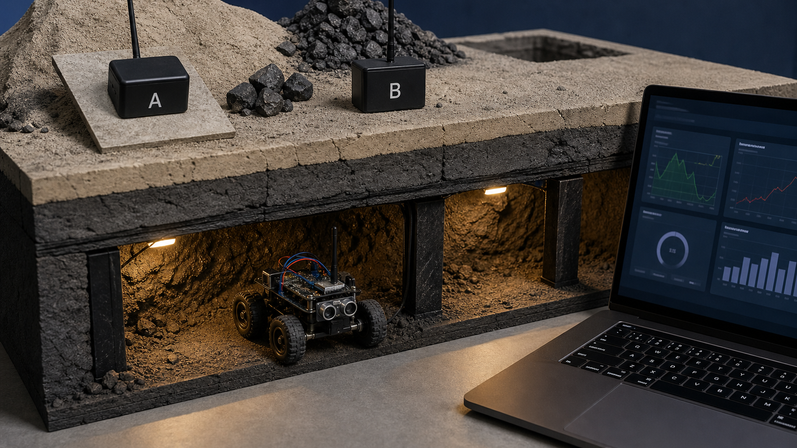
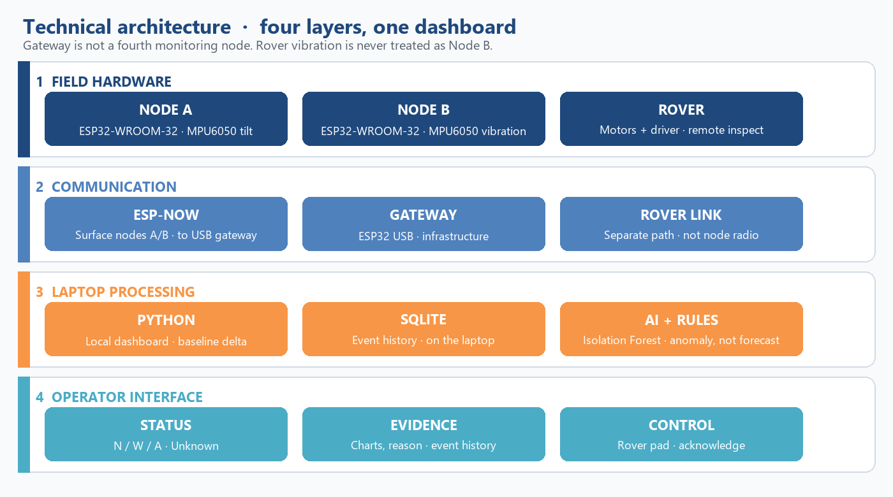
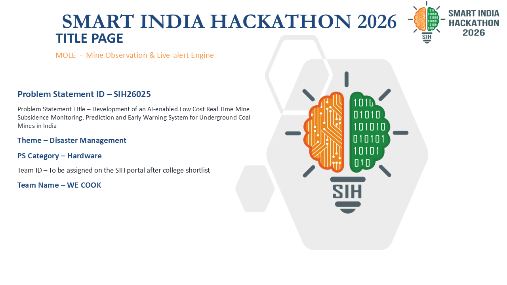

# MOLE — Mine Observation & Live-alert Engine

**Team WE COOK** · **CMRIT** · Smart India Hackathon **2026** · Official PS **[SIH26025](https://github.com/Rithvik-7/WECOOK-MOLE)**  
Ministry of Coal · category **Hardware** · theme **Disaster Management**

[](https://github.com/Rithvik-7/WECOOK-MOLE)
[](software/requirements.txt)
[](AI-PLAN.md)
[](LICENSE)

> Two fixed nodes watch a tabletop mine model. The laptop latches an early warning and runs **Isolation Forest + a 30 s sensor forecast**. A rover inspects **after** the officer decides.  
> Measurements indicate **disturbance**. They do **not** prove a collapse.

**Portal / 6-slide ID: `SIH26025` only.** Do not write `SIH2026025`.



---

## Contents

- [Team](#team)
- [Why this problem](#why-this-problem)
- [What we built](#what-we-built)
- [Run the demo (no hardware)](#run-the-demo-no-hardware)
- [Live hardware](#live-hardware)
- [Pitch, PPT, and judge pack](#pitch-ppt-and-judge-pack)
- [Local websites](#local-websites)
- [AI that judges can check](#ai-that-judges-can-check)
- [Honesty](#honesty)
- [Repository map](#repository-map)
- [Future (team roadmap)](#future-team-roadmap)
- [License](#license)

Teammates and coding agents: start at **[AGENTS.md](AGENTS.md)** (pins, packet format, APIs). Document index: **[docs/](docs/README.md)**. Roster: **[docs/TEAM.md](docs/TEAM.md)**.

---

## Team

**WE COOK** · CMR Institute of Technology (**CMRIT**) · six members.

| Name | Department | On this project |
|---|---|---|
| **Ritvik** | IC, 2nd year | **Team leader** · AI/ML · website |
| **Komala TG** | IC | Website design and backend |
| **Pragati Karvi** | IC | Website design and backend |
| **Pallabi Samantha** | IC | Basic electronics · website design and backend |
| **Devika** | EC | Electronics planning and hardware |
| **Venkatesh** | EC | Electronics planning and hardware |

IC = Instrumentation and Control. EC = Electronics and Communication. Full notes: [docs/TEAM.md](docs/TEAM.md).

The SIH portal **6-slide idea PPT** does not include this roster (official template). Names live here on GitHub.

---

## Why this problem

SIH26025 asks for an **AI-enabled, low-cost, real-time** mine **subsidence monitoring, prediction, and early warning** system.

Underground mining can tilt the ground, open cracks, or change vibration. A safety officer needs to **notice a change, read the evidence, and inspect** — on this project, on a **tabletop model**, not a certified mine.

MOLE is **one** system:

**Node A + Node B + laptop ML + Rover + one local dashboard**

The rover is not optional. ML is not optional. We do not pitch a gas-car maze robot.

---

## What we built

```text
 Node A (ESP32)                 Node B (ESP32)
 MPU6050 + 10 kΩ crack slider   MPU6050 comparison (no slider)
        \                         /
         \______ ESP-NOW ch 1 ____/
                      |
                      v
         Waveshare ESP32-S3-Zero
         USB-C JSON @ 115200
                      |
                      v
         Laptop Flask site  (sklearn lives here)
         rules latch + Isolation Forest + 30 s forecast
                      |
                      v
         Officer decides to inspect
                      |
                      v
         Rover ESP32  Wi-Fi AP Mine-Rover-AP
         L298N drive + ultrasonic + IR + MQ-7 raw + IMU
```



| Unit | Job |
|---|---|
| **Node A** | Tilt, vibration, crack slider |
| **Node B** | Comparison tilt / vibration |
| **Receiver** | ESP-NOW → USB. No sensors |
| **Laptop** | Calibrate, store, rules, ML, UI |
| **Rover** | Remote inspect on its **own** Wi-Fi AP |

---

## Run the demo (no hardware)

```powershell
cd software
python -m pip install -r requirements.txt
python app.py --mode simulate
```

Then open:

| Page | URL |
|---|---|
| Monitoring + AI | http://127.0.0.1:5000/monitoring |
| Rover Inspection | http://127.0.0.1:5000/rover |

Simulate is **permanently labelled**. It cannot persist-train Isolation Forest. Tabletop **priors** still load so IF is READY. Use rehearsal **Rising trend** for the judge-friendly forecast: Node A climbs, Node B stays quiet.

```powershell
python -m pytest -q
```

---

## Live hardware

```powershell
python app.py --mode live --serial COM3
```

Use the **Waveshare ESP32-S3-Zero** COM port (often COM3, VID `303A`). Do **not** point `--serial` at the rover CP2102.

1. Flash four sketches — see [firmware/README.md](firmware/README.md). Receiver: **USB CDC On Boot = Enabled**.
2. Close Arduino Serial Monitor. Prove JSON for `node_id` 1 and 2 at 115200.
3. Baseline A / Baseline B with mounts still. Two-point slider cal (rest = 0 mm).
4. Join **Mine-Rover-AP**, keep the Flask tab, raise wheels, **hold** FWD. ENA/ENB **jumpers stay ON** (not wired to the ESP32).
5. After inspect and recovery, **Inspection done** closes the recovered latch. History stays.

Live USB drop retries every 2 s. Nodes go UNKNOWN after 5 s. Live **never** silently fakes data.

Full pin map, packet struct, and APIs: [AGENTS.md](AGENTS.md). Judge walkthrough: [docs/DEMO.md](docs/DEMO.md).

---

## Pitch, PPT, and judge pack

| File | Use |
|---|---|
| [pitch/SIH26025_WE_COOK_IDEA.pdf](pitch/SIH26025_WE_COOK_IDEA.pdf) | **Official 6-slide idea PPT (PDF for portal)** |
| [pitch/SIH26025_WE_COOK_IDEA.pptx](pitch/SIH26025_WE_COOK_IDEA.pptx) | Same deck, PowerPoint |
| [pitch/SIH26025_WE_COOK_MOLE_2page_summary.pdf](pitch/SIH26025_WE_COOK_MOLE_2page_summary.pdf) | Two-page summary |
| [pitch/SIH26025_WE_COOK_MOLE_Judge_Document.pdf](pitch/SIH26025_WE_COOK_MOLE_Judge_Document.pdf) | Longer judge brief |
| [pitch/SIH26025_WE_COOK_MOLE_Judge_QA.pdf](pitch/SIH26025_WE_COOK_MOLE_Judge_QA.pdf) | Q&A booklet |
| [pitch/SPEAKER-CRIB.md](pitch/SPEAKER-CRIB.md) | ~30 seconds per slide |
| [ppt/](ppt/) | Earlier 6-slide export + artwork |



---

## Local websites

Core demo needs **no venue internet**. Flask binds to localhost. Rover commands go to `http://192.168.4.1` only after the laptop joins **Mine-Rover-AP**.

Libraries, datasheets, and sites we actually used: **[docs/STACK.md](docs/STACK.md)**.

Optional **Pip** helper (Mistral) can answer operator questions. Copy [software/.env.example](software/.env.example) to `software/.env`. Pip is **not** the mine AI. Product AI is sklearn.

---

## AI that judges can check

| Piece | What you see |
|---|---|
| Isolation Forest + LOF | Unusual vs **this tabletop’s** normal · score · top feature · train count |
| Joint Isolation Forest | A vs B residual · local vs common motion |
| Holdout forecast | Next **30 s** of tilt / vibration / Node A gap · MAE · dashed overlay |
| Rules | WATCH 3° / 2 mm · ALERT 6° / 4 mm · three samples · **latch** |

ML **cannot** clear a rule alert. Forecast UI says it is **not a collapse prediction**. Rover IMU never enters node features.

---

## Honesty

| Allowed | Forbidden |
|---|---|
| NORMAL / WATCH / ALERT / UNKNOWN **on this rig** | Mine is safe / certified / collapse imminent |
| Isolation Forest score vs this tabletop | Collapse or subsidence **probability** |
| 30 s forecast of the same signals + MAE | “Roof will fail in N minutes” |
| MQ-7 **raw ADC** | CO ppm from an uncalibrated MQ-7 |
| IR digital flag (GPIO19) | Auto-brake / lidar / autonomy |
| Remote FWD / REV / LEFT / RIGHT / STOP | Camera vision / LLM geology / LoRa as shipped |

Green means **fresh valid data** and no configured tabletop trigger. It does **not** certify a mine.

---

## Repository map

```text
WECOOK-MOLE/
├── README.md                 ← you are here
├── AGENTS.md                 ← as-built contract
├── MOLE-CONTEXT.md           ← product long form
├── docs/                     ← demo, stack, future, document index
├── pitch/                    ← SIH 6-slide + judge PDFs
├── ppt/                      ← artwork and earlier export
├── firmware/                 ← node A, node B, S3 receiver, rover
├── software/                 ← Flask app, sklearn, tests
└── hardware/                 ← rover circuit drawing
```

---

## Future (team roadmap)

After SIH we want a **supervised field trial**, more comparison nodes, and better displacement sensing — still without collapse % or fake certification.

Read **[docs/FUTURE.md](docs/FUTURE.md)** for what we are thinking as a team, and what we refuse to pretend is already built.

---

## License

[MIT](LICENSE) © 2026 Team WE COOK. Hardware designs follow the frozen pin map in `AGENTS.md`. This software is a tabletop demonstrator, not a mine-safety certificate.
