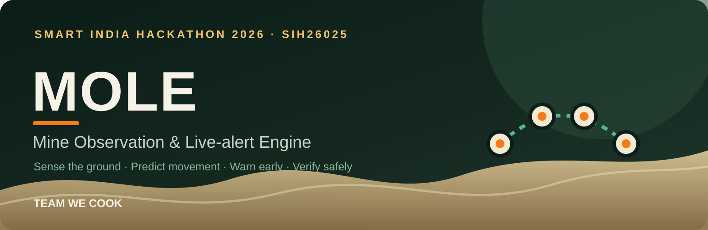

  

  <strong>Sense the ground. Predict movement. Warn early. Verify safely.</strong>

  
  
  
  
  

# MOLE

MOLE (Mine Observation & Live-alert Engine) is Team **WE COOK's** low-cost, offline-first prototype for mine-subsidence monitoring and early warning. It combines distributed surface sensors, a local gateway, explainable safety rules, a web dashboard, an Android field companion, and an operator-approved inspection workflow.

This is the curated **SIH 2026 screening release** for Problem Statement **SIH26025**: _Development of an AI-enabled Low Cost Real Time Mine Subsidence Monitoring, Prediction and Early Warning System for Underground Coal Mines in India_.

> **Safety boundary:** MOLE is a student screening prototype, not a certified field-safety system. Demonstration readings are labelled <code>simulated</code>. Missing or stale data is never presented as safe. No trained ML artifact, field certification, autonomous rescue dispatch, or production communication result is claimed.

## Screening proof

| Deliverable | Open / download |
|---|---|
| Official SIH deck | [PPTX](presentation/MOLE-SIH26025-Official-Format-v2.pptx) · [PDF](presentation/MOLE-SIH26025-Official-Format-v2.pdf) |
| Two-page summary | [PDF](documents/MOLE-SIH26025-Two-Page-Summary.pdf) |
| Detailed judge document | [PDF](documents/MOLE-SIH26025-Judge-Document.pdf) |
| Android screening build | [MOLE-Android.apk](release/MOLE-Android.apk) |
| Sample telemetry | [CSV](telemetry/mole-telemetry.csv) · [Excel](telemetry/mole-telemetry.xlsx) |

## The idea

Conventional inspections can miss localized movement between visits, while a single noisy sensor can create a misleading alarm. MOLE adds continuous, auditable evidence around the decision:

1. **Sense** tilt, vibration, displacement input, gas, and environmental context.
2. **Link** ESP32 nodes to a local receiver and gateway with an offline queue.
3. **Think** with data-quality checks, persistent movement rules, robust trend statistics, and optional anomaly/forecast research.
4. **Act** through local alarms, a live dashboard, incident records, and explainable warnings.
5. **Verify** a flagged location through an operator-approved rover/inspection workflow.
6. **Learn** from reviewed evidence without allowing a model to silently override safety rules.

~~~mermaid
flowchart LR
    A[Surface sensor nodes] --> B[ESP32 receiver]
    B --> C[Local FastAPI gateway]
    C --> D[Trust and safety rules]
    D --> E[Next.js dashboard]
    D --> F[Incident and alert records]
    F --> G[Operator-approved inspection]
    G --> H[Reviewed evidence]
    H -. future training labels .-> D
~~~

## What is implemented

| Area | Screening release | Pilot direction |
|---|---|---|
| Sensing | Four configured nodes, per-channel validity, source and timestamp metadata | Six-node multi-physics surface array |
| Radio | ESP32 receiver and serial gateway | LoRa/long-range field link with store-and-forward |
| Detection | Persistent movement rules, robust window baseline, median shift, trend rate, stale/fault handling | Reviewed Isolation Forest and calibrated short/medium-horizon forecasts |
| Alerts | Explainable condition, incident record, local dashboard, SOS/bulletin workflow | Production SMS, email and push providers |
| Mapping | Schematic East Panel node map and per-node state | Surveyed GIS cells and mine-specific risk zones |
| Inspection | Mission records, evidence notes and safe refusal of unsupported drive commands | Instrumented rover with camera, gas and temperature |
| Assistant | Optional provider-backed evidence assistant with local source context | Offline RAG over approved SOPs and incidents |
| Storage | Local SQLite, exports, reports and backup utility | Hardened gateway storage and controlled synchronization |

## Calibration: set the current position to zero

The calibration page is intentionally simple:

1. Select a station and sensor.
2. Keep the sensor still in its normal position.
3. Pair the operator session and press **Set current position as zero**.
4. MOLE stores the median of recent valid readings as the active baseline.
5. The page shows movement relative to zero. Movement outside the channel's small noise allowance is shown as **DANGER**.

Raw readings are preserved. A new zero supersedes the previous active baseline, and the history remains auditable. The commissioned tilt baseline is also used by the prototype movement rule.

## Current node configuration

| Unit | Prototype role | Current channels |
|---|---|---|
| Node A | Mine-entrance surface motion | MPU tilt, vibration, potentiometer counts |
| Node B | Removable ground panel | MPU tilt, vibration, DS18B20 air temperature |
| Node C | Ventilation shaft | MPU tilt, vibration, potentiometer counts, warmed-up MQ-2 raw signal |
| Node D | Local alarm and climate | BMP280 temperature/pressure, LCD and buzzer; tilt only when an MPU is fitted |
| Receiver | Laptop-connected collector | ESP32-S3 USB serial receiver |
| Rover R1 | Inspection workflow | Mission/evidence records; motion is refused until a controller is confirmed |

Potentiometer counts are not millimetres until mechanically calibrated. MQ-2 values are raw signals, not gas concentration. An unavailable value remains unavailable rather than being replaced with zero.

## Run the fake-data screening demo

The API automatically creates a fresh SQLite database and seeds clearly labelled demonstration readings when the selected database is empty.

### 1. API

~~~powershell
python -m pip install -r api/requirements.txt httpx pytest
$env:MOLE_DB = "$PWD\data\screening-demo.db"
$env:MOLE_OPERATOR_TOKEN = "choose-a-long-demo-token"
python -m uvicorn main:app --app-dir api --host 127.0.0.1 --port 8001
~~~

### 2. Website

Open a second terminal:

~~~powershell
cd web
npm install
$env:MOLE_API_INTERNAL = "http://127.0.0.1:8001"
npm run dev -- --hostname 0.0.0.0 --port 3001
~~~

Open [http://127.0.0.1:3001](http://127.0.0.1:3001). To view it from a phone on the same Wi-Fi network, replace <code>127.0.0.1</code> with the laptop's IPv4 address and allow the selected port through the local firewall.

The public monitoring views open without an account. Acknowledgement, closure, calibration, import commit, and rover notes require pairing the browser with the same <code>MOLE_OPERATOR_TOKEN</code>. The token is never embedded in the frontend source.

## Connect physical nodes

The receiver firmware is in [firmware/receiver](firmware/receiver), node firmware is in the corresponding [firmware](firmware) folders, and the serial-to-API bridge is [gateway/gateway.py](gateway/gateway.py). Wiring and capability limits are documented in [HARDWARE.md](docs/HARDWARE.md) and [WIRING.md](docs/WIRING.md).

Physical packets must retain <code>origin: physical</code>, sequence and timing metadata. The API marks old or implausibly future-dated physical packets stale. Offline and stale nodes are not silently converted to normal.

## Dashboard capabilities

- Live node overview, channel history and source labels
- Simple zero-position calibration with previous-setting history
- Explainable movement, gas, stale-data and sensor-fault states
- Incident acknowledgement, review, closure and generated records
- Schematic panel map and node health
- Telemetry CSV/XLSX export and evidence archive
- Operator-approved inspection missions and evidence notes
- Field companion/SOS outbox for intermittent connectivity
- Optional evidence assistant that remains advisory
- Responsive desktop and phone layouts

## Data and AI trust model

The screening build uses deterministic safety logic and descriptive statistics. It does **not** load a trained Isolation Forest model. The <code>ml/</code> tools are included for reproducible evaluation and future reviewed experiments.

The decision boundary is:

- Rules remain the safety authority.
- A model may add evidence; it may not dismiss an active rule-based warning.
- Every reading carries origin, time, validity and session information.
- Stale, missing and invalid inputs are first-class states.
- Baselines and experiment labels require operator review.
- Rover evidence becomes a potential learning label only after review.

## API highlights

| Endpoint | Purpose |
|---|---|
| <code>GET /health</code> | Local deployment and database health |
| <code>GET /api/state</code> | Nodes, analysis, incidents, missions and data origin |
| <code>POST /api/telemetry</code> | Validated physical/simulated/imported/inferred readings |
| <code>GET/POST /api/calibrations</code> | Baseline records and zero-position workflow |
| <code>GET /api/events</code> | Server-sent live state updates |
| <code>GET /api/exports/telemetry.csv</code> | Auditable telemetry export |
| <code>GET /api/exports/telemetry.xlsx</code> | Spreadsheet export |
| <code>POST /api/incidents/{id}/acknowledge</code> | Protected operator action |
| <code>POST /api/missions</code> | Protected inspection record |

## Repository layout

~~~text
api/           FastAPI service, persistence, analysis and reports
web/           Next.js monitoring and calibration dashboard
mobile/        React Native field companion source
firmware/      ESP32 node and receiver firmware
gateway/       Serial receiver-to-API bridge
ml/            Evaluation and short-horizon research utilities
tests/         Backend and frontend logic tests
docs/          Hardware, wiring, requirements and operations
presentation/  Final official SIH screening deck
documents/     Final screening/judge PDFs
release/       Android APK
telemetry/     Sample labelled telemetry
assets/        README and screening visuals
~~~

## Verification

~~~powershell
python -m pytest tests -q
node tests/test_stage7.mjs
node tests/offline.test.mjs
node tests/map.test.mjs
node tests/forecast.test.mjs
cd web
npm ci
npm run build
~~~

## Known limits before field use

- The site is local HTTP unless a real host and TLS certificate are configured.
- The map is schematic, not surveyed GIS.
- Seed data proves the interface flow, not field performance.
- No measured radio range, weather provider, SMS/email/push provider, or emergency dispatch integration is claimed.
- No trained production ML model is loaded.
- Sensor mounting, site baselines, alarm thresholds, enclosures, power design and maintenance procedures require controlled validation.
- The rover workflow records inspections; it does not claim autonomous motion.

The proposed scale-up is evidence-gated: tabletop prototype → controlled validation → surface pilot → field hardening.

## Research basis

The design direction follows the SIH26025 problem scope and uses primary technical context from DGMS/CSIR-CIMFR, TDK InvenSense, Bosch Sensortec, Espressif, the LoRa Alliance, and scikit-learn/Liu et al. These references guide engineering choices; they do not certify this prototype.

---

**Team WE COOK · Team ID 157436 · Smart India Hackathon 2026 · SIH26025**
